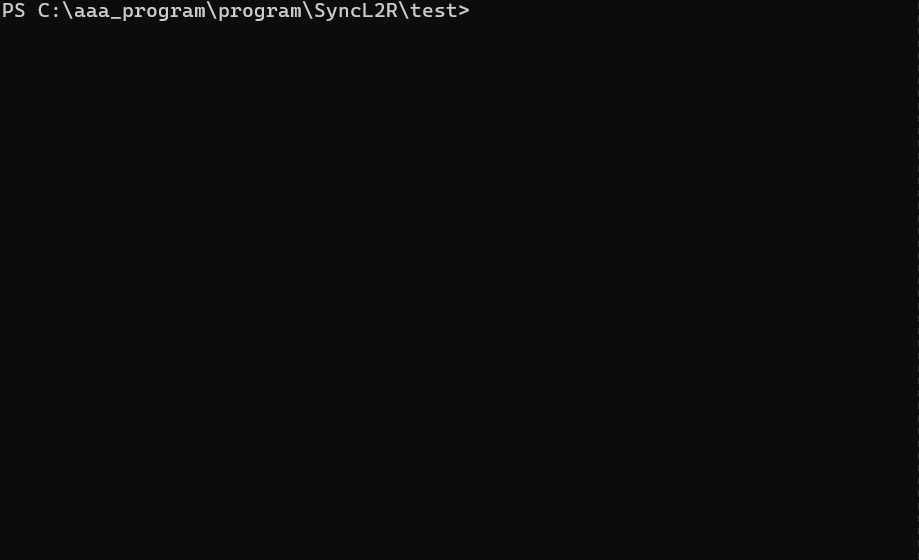

# SyncL2R

同步本地文件夹和远程主机的文件夹内容

- 您可以选择同步文件
- 支持正则表达式匹配
- 手动同步文件，从远程提取文件
- 可以设置自动同步（需要后台任务）
- 可以设置受监视文件夹更改的自动同步（需要后台任务）
- 漂亮的终端输出

## Command

查看更多帮助
`syncl2r --help`
命令列表
| command | doc | usage |
| ------- | ------------------------------ | ----- |
| push | sync local file to remote host |
| pull | pull remote file |
| init | init l2r_config.json |

### Push

**Usage**
`syncl2r push`


### Pull

**Usage**
`syncl2r pull`


## install

**安装**
`python setup.py install`

**require**

```
python >= 3.10
```
