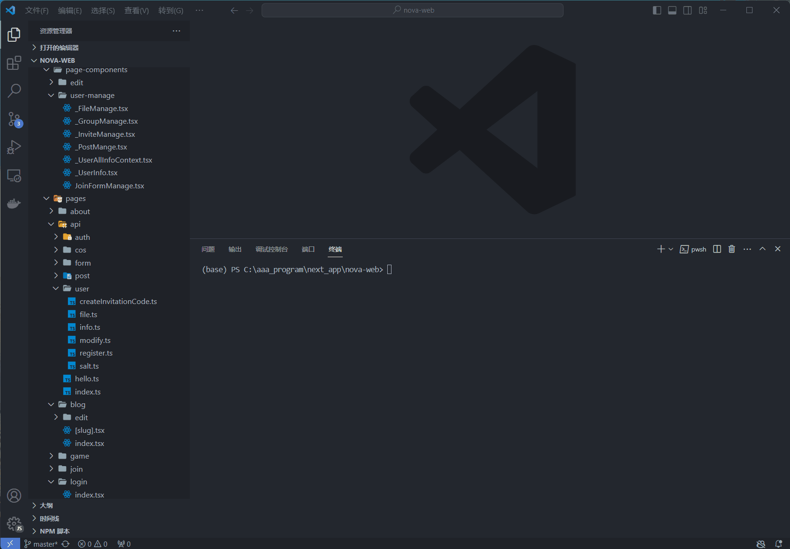
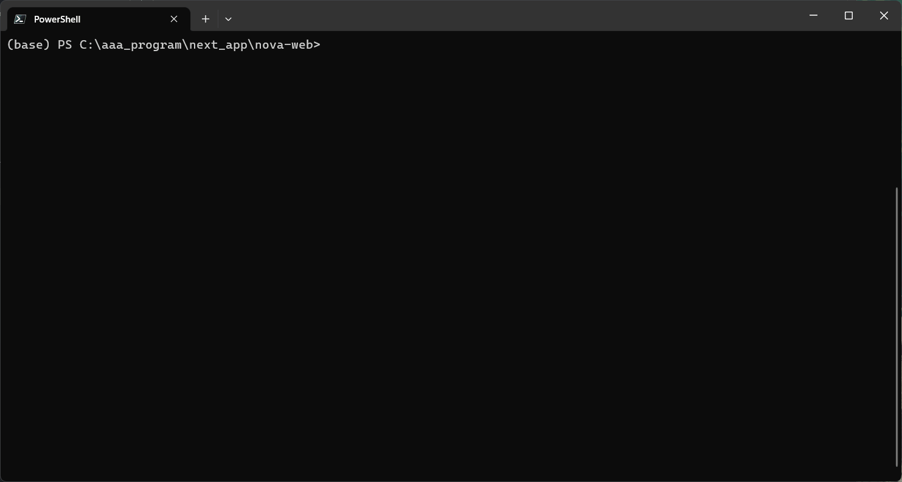
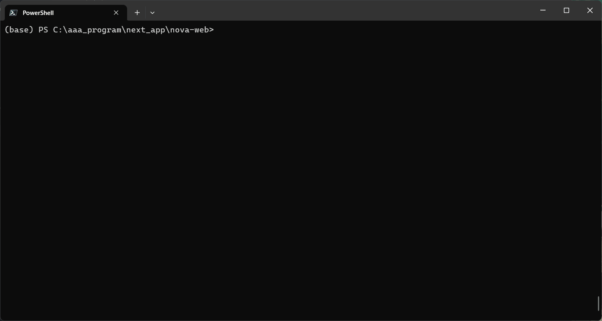

# SyncL2R

```txt
   _____                      __    ___    ____ 
  / ___/ __  __ ____   _____ / /   |__ \  / __ \
  \__ \ / / / // __ \ / ___// /    __/ / / /_/ /
 ___/ // /_/ // / / // /__ / /___ / __/ / _, _/ 
/____/ \__, //_/ /_/ \___//_____//____//_/ |_|  
      /____/                                    
```

一个针对单个项目，离线的小型流水线部署工具

- 可配置忽略文件
- 支持正则表达式匹配
- 手动同步文件，从远程提取文件
- 一键部署任务触发
- 支持自定义动作
- 漂亮的终端输出

[查看详细文档-Wiki](https://github.com/N0I0C0K/SyncL2R/wiki/Why-Syncl2r%3F)

## 适用场景

> 试想你有一个后端/前端项目，在本地开发完成之后，你需要将项目部署到服务器上，一般来讲有以下步骤
> 1. 上传代码到服务器上
> 2. 登录服务器
> 3. 手动进行部署

SyncL2R就是将上面的步骤**缩短到一行命令**。

适用范围：

- 在本地开发，在服务器上部署
- 项目规模不大，没有自己的流水线

## Command

详细的命令列表和帮助文档可以，使用help命令查看

```shell
syncl2r --help
```

命令列表
| command | doc                                                    |
| ------- | ------------------------------------------------------ |
| push    | 推送本地文件到远程（多种模式选择，可自动触发部署任务） |
| pull    | 拉取远程文件到本地                                     |
| init    | 在当前目录下，初始化配置文件                           |
| exec    | 执行自定义动作                                         |

### Push

```shell
syncl2r push
```

支持三种模式：

- soft 只更新上传新增的文件
- normal 只更新发生改变的文件
- hard 删除远程目录下的所有文件，再上传全量文件


### Pull

```shell
syncl2r pull
```


### diff

查看本地文件和远程文件的差异


### show

查看本地/远程目录结构

查看本地同步目录结构：


查看远程目录结构：


### Shell

```shell
syncl2r shell
```

使用提供的config（不填为默认的config文件）, 打开一个远程终端

## Event

Syncl2r支持事件触发，用来执行shell命令，目前支持以下事件：

- `push_complete_exec`，在`Push`任务执行完成之后执行
- `push_start_exec`，在`Push`任务执行之前执行

## Config

config文件名称默认为`config.l2r.yaml`，**如果命令中不指定config会默认寻找当前目录下第一个满足`*.l2r.yaml`的文件**

### 下面以一个nextjs项目部署配置举例

1. 编写配置文件，执行命令`sync init -u root:test123@127.0.0.1:11022 -rp /home/test -lp .`，生成.l2r目录，随后编辑`config.l2r.yaml`

```yaml
connect_config:
  ip: 127.0.0.1                   # 远程主机ip
  username: root                  # 登录用户
  password: 'test123'             # 密码
  port: 11022                     # ssh端口，不填默认22
file_sync_config:
  exclude:                        # 同步排除文件，支持正则匹配
    - node_modules
    - .git
    - .next
    - .env
  remote_root_path: '/home/test'  # 远程根路径
  root_path: .                    # 本地同步根路径
events:                           # 事件只要填写默认每次都会执行（可以设置不执行）
  push_complete_exec:             # 上传完毕后执行命令
    - npm i                       # 每次上传完成之后先更新依赖
    - npm run build               # 完成之后进行构建
    - cmd: npm run start          # 后台执行任务，模式为nohup
      mode: nohup
  push_start_exec:                # 上传开始执行命令
    - echo hello world

```
2. 开始上传，执行`sync push`，每次上传完成之后都可以自动关闭之前的进程，然后触发部署任务。


## install

```shell
python -m pip install .
```

**require**

```shell
python >= 3.10
```
